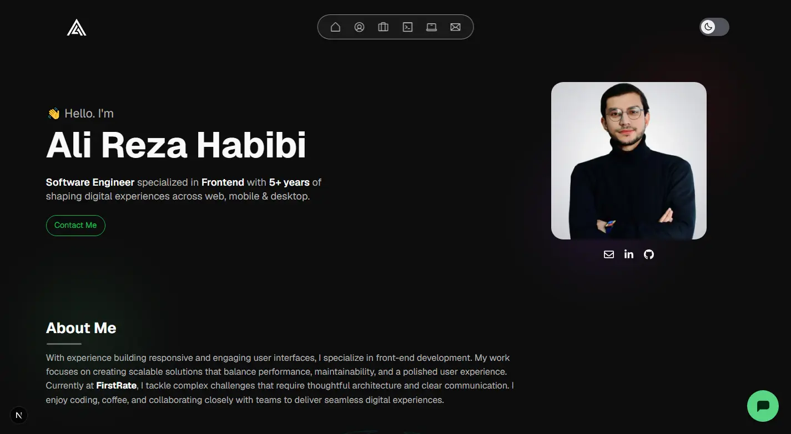
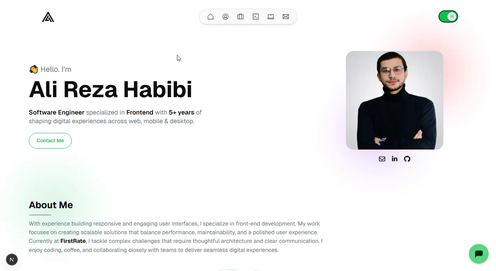
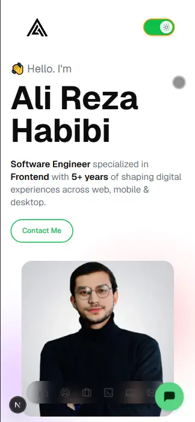

<div align="center">

# 🚀 Ali Reza Habibi | Portfolio

[](https://nextjs.org/)
[](https://react.dev/)
[](https://tailwindcss.com/)
[](https://vercel.com/)
[](LICENSE)

A modern, responsive portfolio website built with Next.js, featuring smooth animations, dark/light theme support, and a functional contact form.

[**View Live Demo →**](https://ahabibi.vercel.app)



</div>

---

## ✨ Features

<table>
<tr>
<td width="50%">

### 🎨 Design & UX

- **Responsive Design** — Looks great on all devices
- **Dark/Light Mode** — Seamless theme switching
- **Smooth Animations** — Polished micro-interactions
- **Modern UI** — Clean, minimalist aesthetic

</td>
<td width="50%">

### ⚡ Performance

- **Server Components** — Optimized rendering
- **Image Optimization** — Next.js Image component
- **Fast Load Times** — Minimal JavaScript bundle
- **SEO Optimized** — Meta tags & Open Graph

</td>
</tr>
<tr>
<td width="50%">

### 🛠️ Functionality

- **Contact Form** — Brevo email integration
- **Project Filtering** — Filter by technology
- **AI Chatbot** — Botpress integration
- **Resume Download** — One-click PDF download

</td>
<td width="50%">

### 🔧 Developer Experience

- **Clean Architecture** — Organized file structure
- **Component-Based** — Reusable components
- **Easy to Customize** — Well-documented code
- **Type-Safe** — Consistent patterns

</td>
</tr>
</table>

---

## 🖥️ Tech Stack

| Category          | Technologies                                              |
| ----------------- | --------------------------------------------------------- |
| **Framework**     | [Next.js 16](https://nextjs.org/) (App Router)            |
| **Language**      | JavaScript (JSX)                                          |
| **Styling**       | [Tailwind CSS 4](https://tailwindcss.com/)                |
| **Icons**         | [React Icons](https://react-icons.github.io/react-icons/) |
| **Email Service** | [Brevo](https://www.brevo.com/) (Sendinblue)              |
| **Chatbot**       | [Botpress](https://botpress.com/)                         |
| **Notifications** | [React Hot Toast](https://react-hot-toast.com/)           |
| **Deployment**    | [Vercel](https://vercel.com/)                             |

---

## 🚀 Getting Started

### Prerequisites

- **Node.js** 18.17 or later
- **npm** or **yarn** or **pnpm**
- **Brevo Account** (for contact form)

### Installation

1. **Clone the repository**

   ```
   git clone https://github.com/shahreyarhabibi/portfolio-next.js.git
   cd portfolio-next.js
   ```

2. **Install dependencies**

   ```
       npm install
       # or
       yarn install
       # or
       pnpm install
   ```

3. **Set up environment variables**

   Create a .env.local file in the root directory:

   ```
   # Brevo (Sendinblue) Configuration
   BREVO_API_KEY=your_brevo_api_key_here
   SENDER_EMAIL=your_verified_sender_email
   SENDER_NAME=Portfolio Contact Form
   RECIPIENT_EMAIL=your_email@example.com
   ```

4. **Run the development server**

   ```
   npm run dev
   # or
   yarn dev
   # or
   pnpm dev
   ```

5. **Open your browser**

   Navigate to http://localhost:3000

## 📁 Project Structure

   ```
   src/
   ├── app/
   │   ├── api/
   │   │   └── contact/
   │   │       └── route.js        # Contact form API endpoint
   │   ├── globals.css             # Global styles & CSS variables
   │   ├── layout.js               # Root layout with metadata
   │   └── page.js                 # Home page
   │
   ├── components/
   │   ├── Header/
   │   │   ├── Header.jsx          # Navigation header
   │   │   └── NavIcons.jsx        # Navigation icons
   │   │
   │   ├── Projects/
   │   │   ├── ProjectCard.jsx     # Individual project card
   │   │   └── ProjectsSection.jsx # Projects grid with filters
   │   │
   │   ├── Services/
   │   │   ├── Service.jsx         # Service card component
   │   │   ├── ServicesSection.jsx # Services grid
   │   │   └── TechnologiesIcons.jsx
   │   │
   │   ├── Education/
   │   │   ├── Education.jsx
   │   │   └── EducationSections.jsx
   │   │
   │   ├── Experience/
   │   │   ├── Experience.jsx
   │   │   └── ExperienceSections.jsx
   │   │
   │   ├── AboutSection.jsx
   │   ├── BotpressChat.jsx        # AI chatbot integration
   │   ├── ContactForm.jsx         # Contact form component
   │   ├── ContactSection.jsx      # Contact section layout
   │   ├── DynamicTitle.jsx
   │   ├── ExperienceSection.jsx
   │   ├── Footer.jsx
   │   ├── HeroSection.jsx
   │   ├── Providers.jsx           # Theme & toast providers
   │   └── SectionsTitle.jsx
   │
   ├── context/
   │   └── ThemeContext.jsx        # Dark/light theme context
   │
   ├── data/
   │   └── projects.js             # Projects data
   │
   └── icons/
       ├── AboutIcon.jsx
       ├── ExperienceIcon.jsx
       ├── HomeIcon.jsx
       ├── MailIcon.jsx
       └── ServicesIcon.jsx
   
   ```

### 📸 Screenshots

<div align="center">
<strong>Dark Mode</strong>
   <br/>
   <br/>

   <br/>
   <br/>
<strong>Light Mode</strong>
   <br/>
   <br/>

   <br/>
   <br/>
<strong>Mobile View</strong>
   <br/>
   <br/>
</div>

## 📬 Contact

<div align="center">

**Ali Reza Habibi** — Software Engineer

[](https://github.com/shahreyarhabibi)
[](https://linkedin.com/in/ali-reza-habibi)
[](https://ahabibi.vercel.app)

</div>

## Acknowledgments

- [Next.js](https://nextjs.org/) — The React Framework
- [Turso](https://turso.tech/) — Edge Database
- [Tailwind CSS](https://tailwindcss.com/) — Utility-first CSS
- [Lucide](https://lucide.dev/) — Beautiful Icons
- [Recharts](https://recharts.org/) — Chart Library

---

## 📝 License

This project is licensed under the **GNU Affero General Public License v3.0** - see the [LICENSE](LICENSE) file for details.

---

<div align="center">
⭐ Star this repo if you found it helpful!

<br/>
<br/>
Made with ❤️ and ☕ by Ali Reza Habibi

</div>
